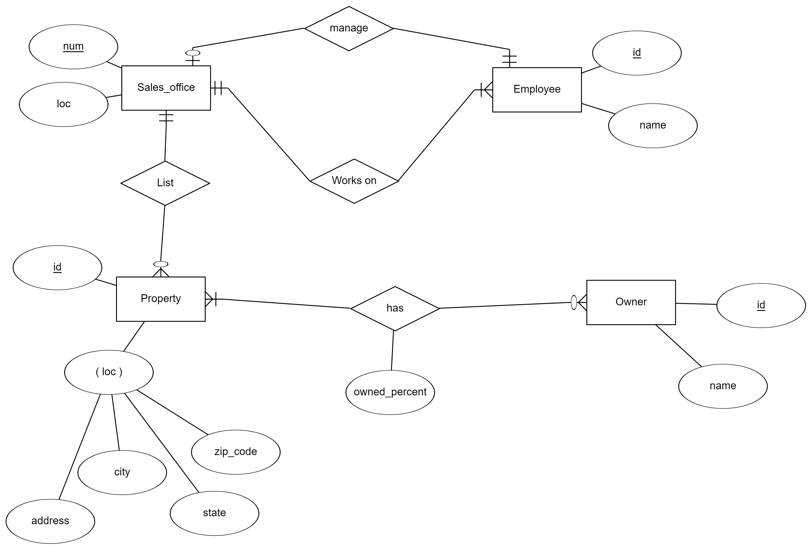
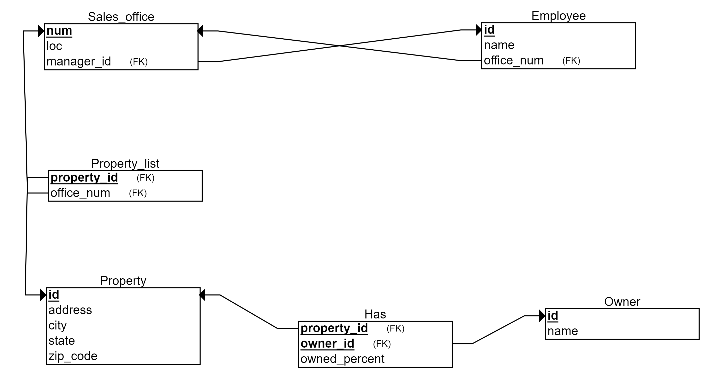

# Sales Office Database Design

This repository contains the database design for a sales office management system. The database captures information about sales offices, employees, properties, and property ownership. The design emphasizes efficient data management, adherence to business requirements, and normalization.

## Table Of Content

<!-- TOC -->

- [Sales Office Database Design](#sales-office-database-design)
    - [Table Of Content](#table-of-content)
    - [Business Requirement](#business-requirement)
    - [How To Use](#how-to-use)
    - [Design](#design)
        - [Entity-Relationship Diagram ERD](#entity-relationship-diagram-erd)
        - [Database Schema](#database-schema)
        - [Normalized Schema](#normalized-schema)
        - [Enhanced Entity-Relationship Diagram EERD](#enhanced-entity-relationship-diagram-eerd)
    - [Implementation](#implementation)
    - [License](#license)

<!-- /TOC -->

## Business Requirement

The following describes this organization:

- The firm has a number of sales offices in several states. Attributes of sales office include Office_Number and Location.
- Each sales office is assigned one or more employees. Attributes of employee include Employee_ID and Employee_Name. An employee must be assigned to only one sales office.
- For each sales office, there is always one employee assigned to manage that office.
- The firm lists property for sale. Attributes of property include Property_ID and Location. Components of Location include Address, City, State, and Zip_Code.
- Each property must be listed with one (and only one) of the sales offices. A sales office may have any number of properties listed, or may have no properties listed.
- Each property may have zero or more owners. Attributes of owners are Owner_ID and Owner_Name. An owner may own one or more properties. The system stores the percent owned by each owner in each property.

**[&uarr; Top](#table-of-centent)**

## How To Use

This could include steps for setting up the database, loading data, executing queries, and any other relevant details.

**[&uarr; Top](#table-of-centent)**

## Design

### Entity-Relationship Diagram (ERD)

**[&uarr; Top](#table-of-centent)**

### Database Schema

**[&uarr; Top](#table-of-centent)**

### Normalized Schema

**[&uarr; Top](#table-of-centent)**

### Enhanced Entity-Relationship Diagram (EERD)

**[&uarr; Top](#table-of-centent)**

## Implementation

Explore the `queries` directory for the implementation details, including creating the schema, loading data, and executing SQL queries.

**[&uarr; Top](#table-of-centent)**

## License

This project is licensed under the [MIT License](LICENSE).
